# Mixed Workflow — Agents + Executors

Example of mixing **AI agents** and **custom executors** in a single workflow using the [`Microsoft.Agents.AI.Workflows`](https://www.nuget.org/packages/Microsoft.Agents.AI.Workflows) package.

The workflow implements a **Code Review pipeline** that combines deterministic static analysis with AI-powered qualitative review and executive summarization.

## Workflow



## How the Pipeline Works

The workflow uses **adapter executors** to bridge deterministic code (executors) and AI agents — a required pattern because agents communicate via `ChatMessage` + `TurnToken`, while executors use plain types like `string`.

| Step | Node | Type | Role |
|---|---|---|---|
| 1 | `CodeInput` | Executor | Receives source code and stores it in workflow state |
| 2 | `StaticAnalysis` | Executor | Runs deterministic checks: line count, cyclomatic complexity, pattern warnings |
| 3 | `ReportToChat` | Adapter Executor | Converts `string` report → `ChatMessage` + `TurnToken` |
| 4 | `CodeReviewer` | AI Agent | Qualitative review: bugs, readability, best practices |
| 5 | `ReviewSync` | Adapter Executor | Extracts severity, formats review for the next agent |
| 6 | `SummaryAgent` | AI Agent | Produces executive summary: score, approval, top 3 actions |
| 7 | `FinalOutput` | Executor | Prints formatted report to the console (once per execution) |

## Key Learning

> **Adapter executors** are essential when connecting executors to agents.  
> They convert data types (`string → ChatMessage`) and send a `TurnToken` to trigger agent processing.  
> Without them, the workflow fails due to type mismatches.

```
Executor (string) ──► Adapter Executor ──► AIAgent (ChatMessage + TurnToken)
                       [SendsMessage]
```

## Project Structure

```
src/MixedWorkflowAgentsAndExecutors/
├── Program.cs                        # Workflow assembly and execution
└── Executors/
    ├── CodeInputExecutor.cs          # Entry point — stores original code in state
    ├── StaticAnalysisExecutor.cs     # Deterministic analysis (no AI)
    ├── ReportToChatExecutor.cs       # Adapter: string → ChatMessage + TurnToken
    ├── ReviewSyncExecutor.cs         # Adapter: agent output → next agent
    └── FinalOutputExecutor.cs        # Final display — idempotent (prints once)
```

## Prerequisites

- [.NET 10 SDK](https://dotnet.microsoft.com/download/dotnet/10.0)
- Access to an **Azure OpenAI** resource with a chat deployment (default: `gpt-4o-mini`)
- Authentication via `DefaultAzureCredential` (Azure CLI, Visual Studio, etc.)

## Setup

Create a `.env` file in `src/MixedWorkflowAgentsAndExecutors/`:

```env
AZURE_OPENAI_ENDPOINT=https://<your-resource>.openai.azure.com/
AZURE_OPENAI_DEPLOYMENT_NAME=gpt-4o-mini
```

## Running

```bash
cd src/MixedWorkflowAgentsAndExecutors
dotnet run
```

The program runs the full pipeline against a sample C# method and prints:

1. **Static analysis results** — line count, complexity, pattern warnings
2. **AI code review** (streamed) — severity, problems, positive points
3. **Executive summary** (streamed) — score, approval status, top 3 actions
4. **Final formatted report** — printed once at the end via `FinalOutputExecutor`

## Packages

| Package | Version |
|---|---|
| `Microsoft.Agents.AI` | 1.4.0 |
| `Microsoft.Agents.AI.OpenAI` | 1.4.0 |
| `Microsoft.Agents.AI.Workflows` | 1.4.0 |
| `Azure.AI.OpenAI` | 2.9.0-beta.1 |
| `Azure.Identity` | 1.21.0 |
| `dotenv.net` | 4.0.2 |

## License

See the [LICENSE](LICENSE) file.
